<div align="center">


# 🚗 On-Road Vehicle Breakdown Service

### 24/7 Emergency Assistance Platform | ২৪/৭ জরুরি যানবাহন সহায়তা প্ল্যাটফর্ম

<div align="center">
  <a href="https://on-road-vehicle-breakdown.vercel.app/en">
    
  </a>
  <a href="https://on-road-vehicle-breakdown.vercel.app/en">
    
  </a>
</div>

<p align="center">
  A comprehensive solution connecting stranded drivers with nearby garages and certified mechanics instantly.
  <br>
  ড্রাইভারদের এবং গ্যারেজ/মেকানিকদের সাথে তাৎক্ষণিকভাবে সংযোগকারী একটি পূর্ণাঙ্গ সমাধান।
</p>

</div>

---

## 📋 Table of Contents

- [📖 Introduction](#-introduction)
- [✨ Key Features Showcase](#-key-features-showcase)
- [📊 System Architecture](#-system-architecture)
  - [ER Diagram](#entity-relationship-diagram)
  - [Data Flow](#data-flow-diagram)
- [⚙️ Tech Stack](#️-tech-stack)
- [🚀 Getting Started](#-getting-started)
- [🔐 Environment Setup](#-environment-configuration)
- [📁 Project Structure](#-project-structure)

---

## 📖 Introduction

**On-Road Vehicle Breakdown** is a modern, full-stack platform designed to revolutionize roadside assistance in Bangladesh. Built with **Next.js 15**, it offers real-time tracking, secure payments, and AI-powered diagnostics.

**অন-রোড ভেহিকেল ব্রেকডাউন** একটি আধুনিক ফুল-স্ট্যাক প্ল্যাটফর্ম যা বাংলাদেশের রোডসাইড অ্যাসিস্ট্যান্স সেবায় বিপ্লব ঘটাতে তৈরি করা হয়েছে। **Next.js 15** দিয়ে তৈরি, এতে রয়েছে রিয়েল-টাইম ট্র্যাকিং, নিরাপদ পেমেন্ট এবং এআই-চালিত ডায়াগনস্টিক সুবিধা।

---

## ✨ Key Features Showcase

We have carefully designed the interface to be responsive and intuitive. Below are the key features with previews.
আমরা ইন্টারফেসটি রেসপন্সিভ এবং সহজবোধ্য করার জন্য যত্নসহকারে ডিজাইন করেছি। নিচে প্রিভিউ সহ মূল ফিচারগুলো দেওয়া হলো।

### 🏠 Home & Landing Page

|                                                                 User Interface (Desktop & Mobile)                                                                  | Feature Details                                                                                                                                                                                                                                                                                                                      |
| :----------------------------------------------------------------------------------------------------------------------------------------------------------------: | :----------------------------------------------------------------------------------------------------------------------------------------------------------------------------------------------------------------------------------------------------------------------------------------------------------------------------------- |
| <div align="center">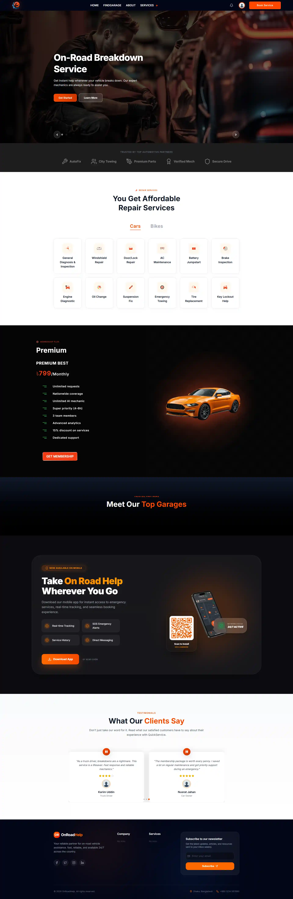<br><br></div> | **Dynamic Landing Page**<br><br>🇬🇧 A visually engaging landing page featuring a hero section, immediate call-to-action for emergency services, featured top garages, and service categories.<br><br>🇧🇩 একটি দৃষ্টিনন্দন ল্যান্ডিং পেজ যেখানে হিরো সেকশন, জরুরি সেবার জন্য তাৎক্ষণিক বাটন, সেরা গ্যারেজ এবং সার্ভিস ক্যাটাগরি রয়েছে। |

### 🔍 Find Garage & Booking

|                                                                         User Interface (Desktop & Mobile)                                                                          | Feature Details                                                                                                                                                                                                                                                                                                                                         |
| :--------------------------------------------------------------------------------------------------------------------------------------------------------------------------------: | :------------------------------------------------------------------------------------------------------------------------------------------------------------------------------------------------------------------------------------------------------------------------------------------------------------------------------------------------------ |
|  <div align="center">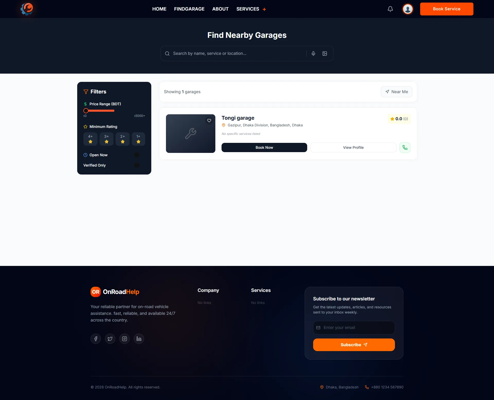<br><br>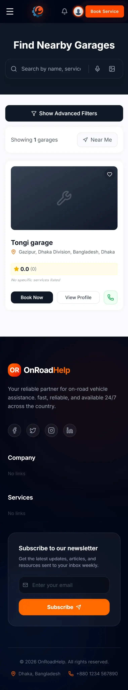</div>  | **Advanced Garage Search**<br><br>🇬🇧 Users can find nearby garages using geolocation or filters. Results show ratings, distance, and available services. Includes map view integration.<br><br>🇧🇩 ব্যবহারকারীরা জিওলোকেশন বা ফিল্টার ব্যবহার করে কাছের গ্যারেজ খুঁজে পেতে পারেন। ফলাফলে রেটিং, দূরত্ব এবং উপলব্ধ সেবা দেখা যায়। ম্যাপ ভিউ অন্তর্ভুক্ত। |
| <div align="center">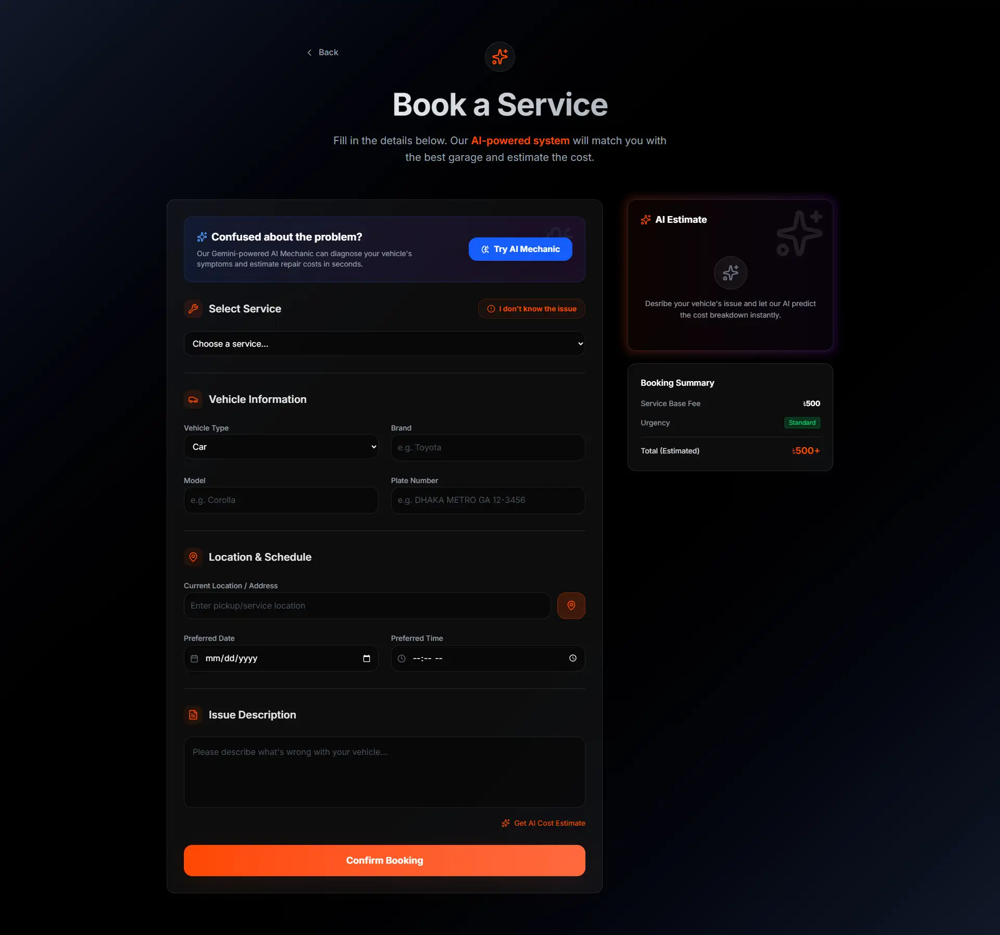<br><br>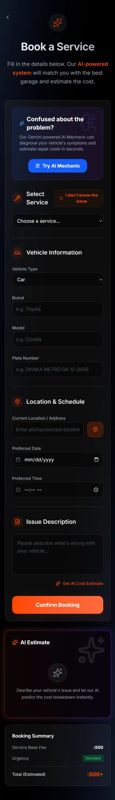</div> | **Service Booking Flow**<br><br>🇬🇧 Seamless booking process where users select services, describe issues, and choose time slots. Includes AI diagnosis integration.<br><br>🇧🇩 সহজ বুকিং প্রক্রিয়া যেখানে ব্যবহারকারীরা সার্ভিস নির্বাচন করেন, সমস্যা বর্ণনা করেন এবং সময় নির্ধারণ করেন। এআই ডায়াগনসিস ইন্টিগ্রেশন যুক্ত।                             |

### 🔐 Authentication

|                                                                  User Interface (Desktop & Mobile)                                                                   | Feature Details                                                                                                                                                                                                                                                                        |
| :------------------------------------------------------------------------------------------------------------------------------------------------------------------: | :------------------------------------------------------------------------------------------------------------------------------------------------------------------------------------------------------------------------------------------------------------------------------------- |
| <div align="center">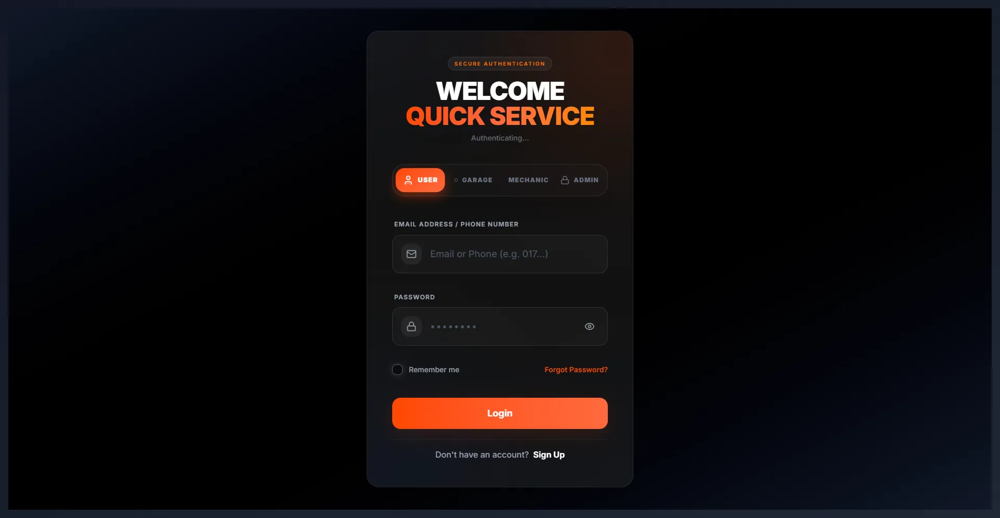<br><br>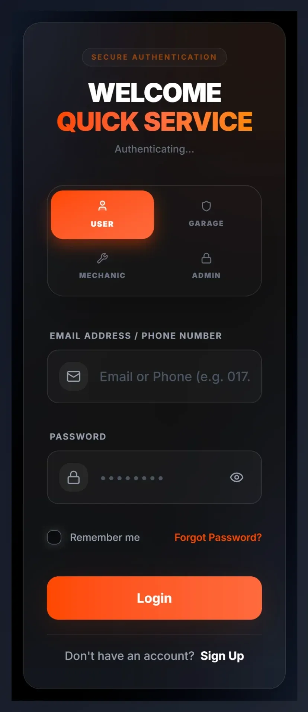</div> | **Secure Authentication**<br><br>🇬🇧 Robust login and registration system using JWT security. Supports separate flows for Users and Garage Owners.<br><br>🇧🇩 JWT সিকিউরিটি ব্যবহার করে শক্তিশালী লগইন এবং রেজিস্ট্রেশন সিস্টেম। ইউজার এবং গ্যারেজ মালিকদের জন্য আলাদা ফ্লো সাপোর্ট করে। |

### 👤 User Dashboard

|                                                                           User Interface (Desktop & Mobile)                                                                            | Feature Details                                                                                                                                                                                                                                                                               |
| :------------------------------------------------------------------------------------------------------------------------------------------------------------------------------------: | :-------------------------------------------------------------------------------------------------------------------------------------------------------------------------------------------------------------------------------------------------------------------------------------------- |
| <div align="center"><br><br>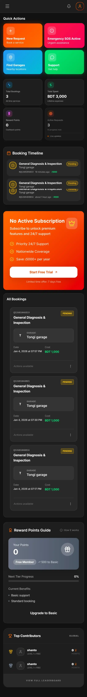</div> | **Mission Control Dashboard**<br><br>🇬🇧 A comprehensive user dashboard tracking active requests, SOS alerts, rewards loyalty points, and recent activity.<br><br>🇧🇩 একটি পূর্ণাঙ্গ ইউজার ড্যাশবোর্ড যা সক্রিয় অনুরোধ, এসওএস সতর্কতা, রিওয়ার্ড পয়েন্ট এবং সাম্প্রতিক কার্যকলাপ ট্র্যাক করে। |
|      <div align="center"><br><br>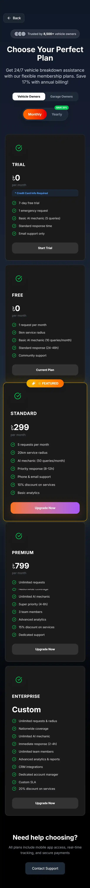</div>      | **Subscription Plans**<br><br>🇬🇧 Users can subscribe to premium tiers for benefits like free towing, discounts, and priority support.<br><br>🇧🇩 ব্যবহারকারীরা ফ্রি টোয়িং, ডিসকাউন্ট এবং অগ্রাধিকার সাপোর্টের মতো সুবিধার জন্য প্রিমিয়াম টিয়ারে সাবস্ক্রাইব করতে পারেন।                     |

### 🔧 Garage & Mechanic Dashboard

|                                                                               User Interface (Desktop & Mobile)                                                                                | Feature Details                                                                                                                                                                                                                                                                                         |
| :--------------------------------------------------------------------------------------------------------------------------------------------------------------------------------------------: | :------------------------------------------------------------------------------------------------------------------------------------------------------------------------------------------------------------------------------------------------------------------------------------------------------ |
|   <div align="center">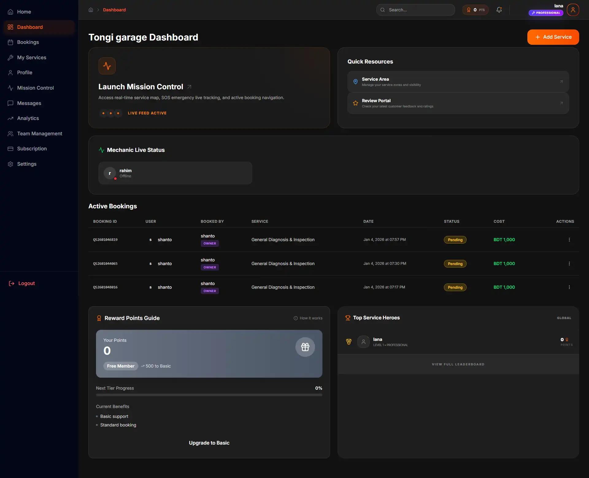<br><br>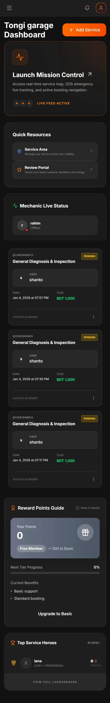</div>   | **Garage Management**<br><br>🇬🇧 Garage owners have a powerful dashboard to manage bookings, track revenue, manage mechanics, and respond to SOS alerts.<br><br>🇧🇩 গ্যারেজ মালিকদের জন্য বুকিং ম্যানেজ, আয় ট্র্যাকিং, মেকানিক ম্যানেজ এবং এসওএস সতর্কতায় সাড়া দেওয়ার জন্য একটি শক্তিশালী ড্যাশবোর্ড। |
| <div align="center">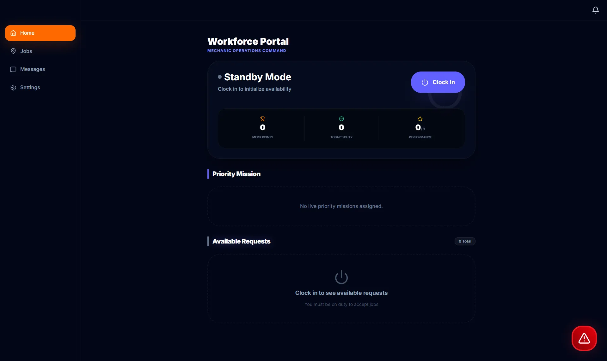<br><br></div> | **Mechanic View**<br><br>🇬🇧 Dedicated view for field mechanics to receive job card details and navigate to customer locations.<br><br>🇧🇩 ফিল্ড মেকানিকদের জন্য ডেডিকেটেড ভিউ যেখানে তারা জব কার্ডের বিবরণ পায় এবং কাস্টমার লোকেশনে নেভিগেট করতে পারে।                                                  |

### 👮 Admin Dashboard

|                                                                            User Interface (Desktop & Mobile)                                                                             | Feature Details                                                                                                                                                                                                                                                                                     |
| :--------------------------------------------------------------------------------------------------------------------------------------------------------------------------------------: | :-------------------------------------------------------------------------------------------------------------------------------------------------------------------------------------------------------------------------------------------------------------------------------------------------- |
| <div align="center">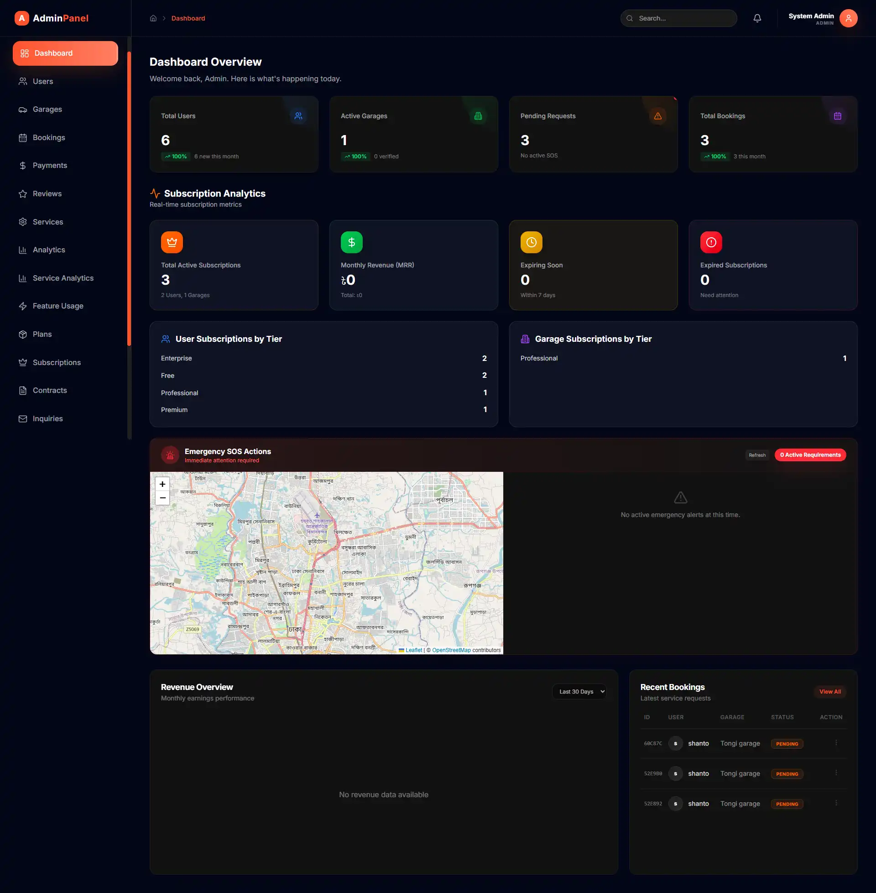<br><br>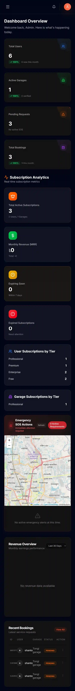</div> | **Super Admin Control**<br><br>🇬🇧 Full system oversight including user/garage management, financial analytics, content verification, and system settings.<br><br>🇧🇩 সম্পূর্ণ সিস্টেম ওভারসাইট যার মধ্যে রয়েছে ইউজার/গ্যারেজ ম্যানেজমেন্ট, আর্থিক বিশ্লেষণ, কন্টেন্ট ভেরিফিকেশন এবং সিস্টেম সেটিংস। |

### 💳 Checkout & Payments

|                                                                     User Interface (Desktop & Mobile)                                                                      | Feature Details                                                                                                                                                                                                                                           |
| :------------------------------------------------------------------------------------------------------------------------------------------------------------------------: | :-------------------------------------------------------------------------------------------------------------------------------------------------------------------------------------------------------------------------------------------------------- |
| <div align="center">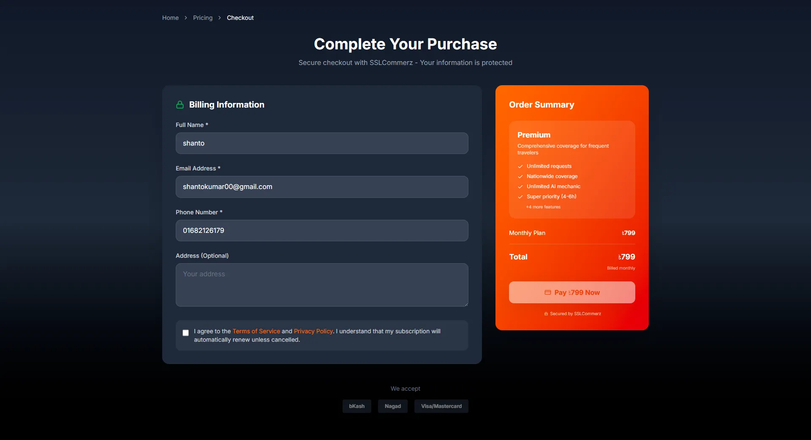<br><br>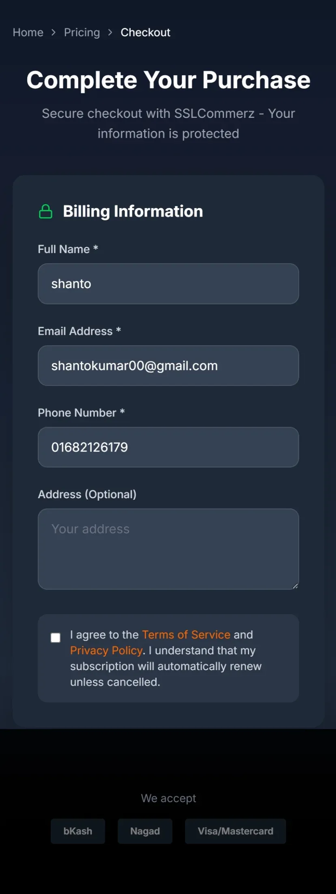</div> | **Seamless Checkout**<br><br>🇬🇧 Secure checkout process integrated with SSLCommerz for local payment methods (Bkash, Nagad, Cards).<br><br>🇧🇩 স্থানীয় পেমেন্ট মেথড (বিকাশ, নগদ, কার্ড) এর জন্য SSLCommerz-এর সাথে ইন্টিগ্রেটেড নিরাপদ চেকআউট প্রক্রিয়া। |

---

## 📊 System Architecture

### Entity Relationship Diagram

The platform manages complex relationships between Users, Garages, Services, and Bookings.

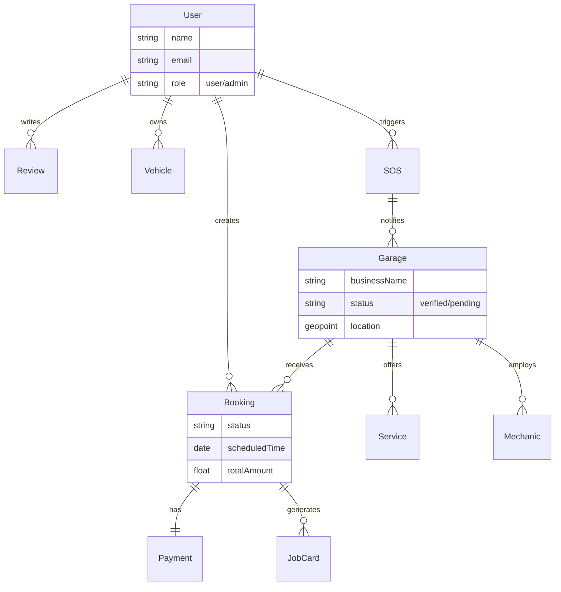

### Data Flow Diagram

How data moves through our Next.js App Router architecture.

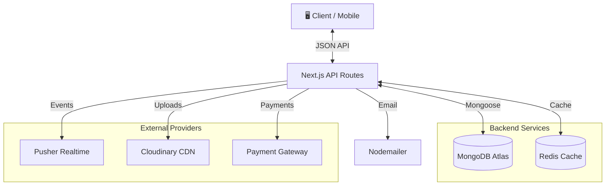

---

## ⚙️ Tech Stack

### Core Framework

- **Frontend**: Next.js 15 (App Router), React 19
- **Styling**: Tailwind CSS 4, Classic CSS, Framer Motion
- **Language**: JavaScript

### Backpack & Data

- **Database**: MongoDB (Mongoose ODM)
- **Caching**: Redis (Upstash)
- **State Management**: Redux Toolkit, Redux Persist

### Services & Integrations

- **Authentication**: JWT (Jose), Bcrypt
- **Real-time**: Pusher
- **Maps**: Leaflet (OpenStreetMap)
- **Payment**: SSLCommerz
- **Media**: Cloudinary
- **AI**: Google Generative AI (Gemini)
- **Email**: Nodemailer
- **Monitoring**: Sentry

---

## 🚀 Getting Started

### Prerequisites

- Node.js 18+
- MongoDB Database
- Cloudinary Account
- Pusher Account (for realtime)

### Installation

1. **Clone the repository**

   ```bash
   git clone https://github.com/CodeCommandBD/On_Road_Vehicle_Breakdown-master.git
   cd on-road-vehicle-breakdown
   ```

2. **Install dependencies**

   ```bash
   npm install
   # or
   yarn install
   ```

3. **Configure Environment**
   Duplicate `.env.example` to `.env.local` and fill in the details.

   ```bash
   cp .env.example .env.local
   ```

4. **Run Development Server**
   ```bash
   npm run dev
   ```
   Visit `http://localhost:3000`

---

## 🔐 Environment Configuration

See [ENV_VARIABLES.md](./ENV_VARIABLES.md) for a complete guide.

Critical variables needed:

```env
MONGODB_URI=mongodb+srv://...
JWT_SECRET=...
NEXT_PUBLIC_CLOUDINARY_CLOUD_NAME=...
PUSHER_APP_ID=...
```

---

## 📁 Project Structure

```bash
├── app/                  # Next.js App Router Pages
│   ├── (auth)/           # Authentication Routes
│   ├── (main)/           # Public Pages (Home, Search)
│   ├── admin/            # Admin Dashboard
│   ├── garage/           # Garage Dashboard
│   └── api/              # Backend API Routes
├── components/           # React Components
│   ├── admin/            # Admin Components
│   ├── garage/           # Garage Components
│   └── home/             # Landing Page Components
├── lib/                  # Utilities & Helpers
│   ├── db/               # Database Connection & Models
│   └── utils/            # Helper Functions
├── messages/             # i18n Translations (en.json, bn.json)
└── public/               # Static Assets & Images
```

---

## 🤝 Contributing

We welcome contributions! Please feel free to submit a Pull Request.

1. Fork the Project
2. Create your Feature Branch (`git checkout -b feature/AmazingFeature`)
3. Commit your Changes (`git commit -m 'Add some AmazingFeature'`)
4. Push to the Branch (`git push origin feature/AmazingFeature`)
5. Open a Pull Request

---

## 📄 License

This project is licensed under the **MIT License** - see the [LICENSE](LICENSE) file for details.

---

## 📞 Contact

**Project Creator** - [Your Name](https://your-portfolio.com)

- **Email**: your.email@example.com
- **LinkedIn**: [linkedin.com/in/your-profile](https://linkedin.com/in/your-profile)
- **Project Link**: [https://github.com/your-username/on-road-vehicle-breakdown](https://github.com/your-username/on-road-vehicle-breakdown)

---

<div align="center">

**Made with ❤️ in Bangladesh**

</div>
