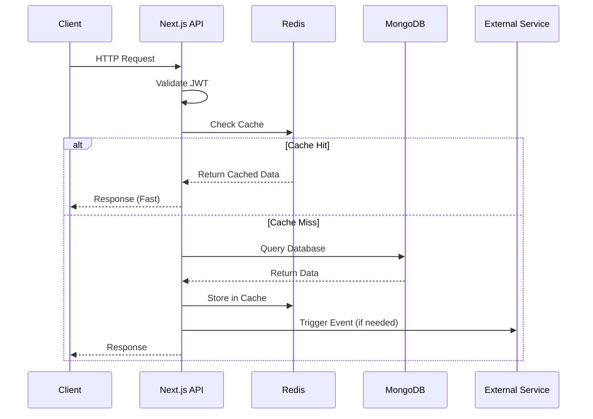
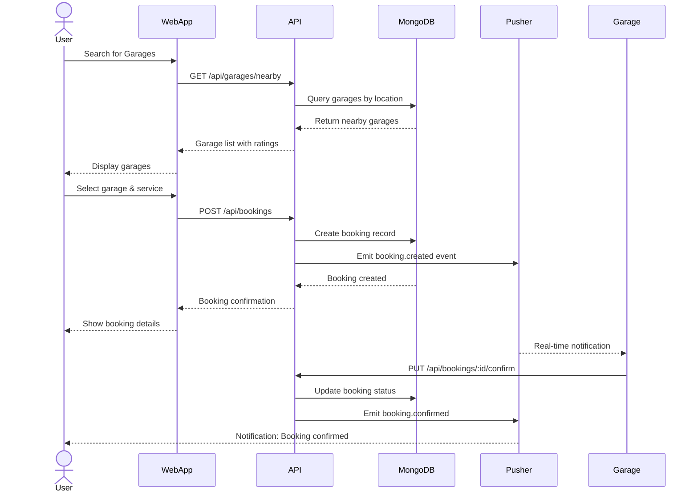
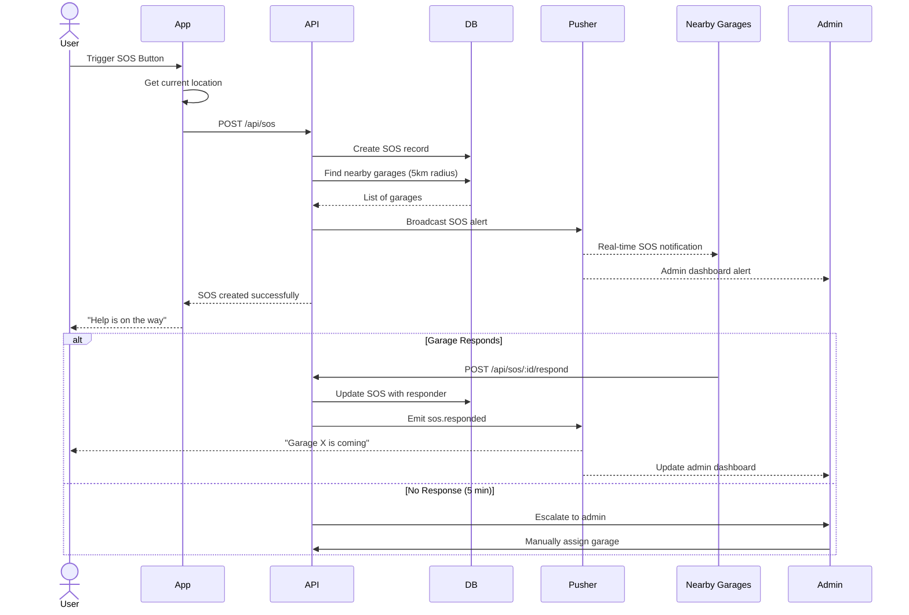
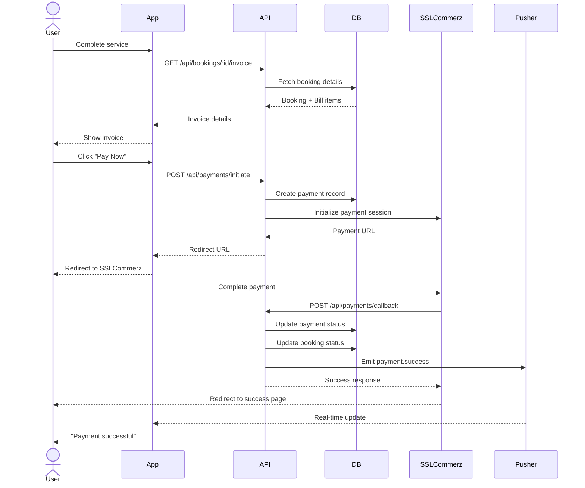

# 🏗️ System Architecture Documentation

## Table of Contents

- [Overview](#overview)
- [Complete Entity Relationship Diagram](#complete-entity-relationship-diagram)
- [Data Flow Architecture](#data-flow-architecture)
- [Sequence Diagrams](#sequence-diagrams)
- [Database Schema Details](#database-schema-details)

---

## Overview

The On-Road Vehicle Breakdown platform is built on a modern microservices-inspired architecture using Next.js 15 App Router, MongoDB for data persistence, Redis for caching, and Pusher for real-time communication.

### Architecture Principles

- **Separation of Concerns**: Clear boundaries between UI, API, and data layers
- **Scalability**: Horizontal scaling through stateless API design
- **Real-time**: Event-driven architecture for live updates
- **Security**: Multi-layer security with JWT, rate limiting, and CSP headers

---

## Complete Entity Relationship Diagram

This diagram shows all 38 database models and their relationships:

```mermaid
erDiagram
    %% Core User Management
    User ||--o{ Booking : creates
    User ||--o{ Review : writes
    User ||--o{ SOS : triggers
    User ||--o{ Notification : receives
    User ||--o{ Message : sends
    User ||--o{ PointsRecord : earns
    User ||--o{ Redemption : redeems
    User ||--o{ SavedSearch : saves
    User ||--|| Subscription : has
    User ||--o{ TeamMember : manages
    User ||--o{ TeamInvitation : sends
    User ||--o{ ActivityLog : generates
    User ||--o{ Diagnosis : requests
    User ||--o{ Contract : signs

    %% Garage Management
    Garage ||--o{ Service : offers
    Garage ||--o{ Booking : receives
    Garage ||--o{ Review : receives
    Garage ||--o{ SOS : responds_to
    Garage ||--|| GaragePerformance : has
    Garage ||--|| Subscription : has
    Garage ||--o{ TeamMember : employs

    %% Booking & Service Flow
    Booking ||--|| Payment : has
    Booking ||--|| JobCard : generates
    Booking ||--|| Invoice : creates
    Booking }o--|| Service : for
    Booking }o--|| User : assigned_mechanic

    %% Payment & Financial
    Payment ||--o{ RevenueMetrics : contributes_to
    Subscription ||--|| Package : based_on
    Subscription ||--o{ Payment : generates

    %% Analytics & Tracking
    AnalyticsEvent ||--|| User : tracks
    AnalyticsEvent ||--|| Garage : tracks
    ConversionFunnel ||--|| User : tracks

    %% Support & Communication
    SupportTicket ||--|| User : created_by
    Support ||--|| User : assists
    Conversation ||--o{ Message : contains
    ContactInquiry ||--|| User : submitted_by

    %% System Management
    Organization ||--o{ User : contains
    Organization ||--o{ Contract : manages
    Branding ||--|| Organization : customizes
    FooterLink ||--|| Organization : displays
    ApiKey ||--|| User : belongs_to
    WebhookSubscription ||--|| Organization : subscribes
    Integration ||--|| Organization : connects
    Attendance ||--|| User : tracks
    Reward ||--|| User : grants
    Coupon ||--o{ Booking : applies_to

    %% User Entity Details
    User {
        ObjectId _id PK
        string name
        string email UK
        string password
        string role "user|garage|admin|mechanic"
        string membershipTier
        date membershipExpiry
        number rewardPoints
        number totalBookings
        number totalSpent
        array vehicles
        object location
        object enterpriseTeam
        object mechanicProfile
        boolean isActive
        boolean isVerified
    }

    %% Garage Entity Details
    Garage {
        ObjectId _id PK
        ObjectId owner FK
        string name
        string email
        string phone
        object address
        object location
        array services FK
        array images
        object rating
        object operatingHours
        boolean is24Hours
        boolean isVerified
        boolean isActive
        string membershipTier
        array vehicleTypes
        object verification
        array teamMembers
    }

    %% Booking Entity Details
    Booking {
        ObjectId _id PK
        ObjectId user FK
        ObjectId garage FK
        ObjectId service FK
        ObjectId assignedMechanic FK
        string bookingNumber UK
        string status
        string vehicleType
        object vehicleInfo
        object location
        object driverLocation
        number estimatedCost
        number actualCost
        boolean isPaid
        object startOTP
        object completionOTP
        date scheduledAt
        date completedAt
        object rating
        array billItems
    }

    %% Service Entity Details
    Service {
        ObjectId _id PK
        ObjectId garage FK
        string name
        string description
        string category
        number basePrice
        number estimatedDuration
        array vehicleTypes
        boolean isActive
        boolean isEmergency
    }

    %% Payment Entity Details
    Payment {
        ObjectId _id PK
        ObjectId booking FK
        ObjectId user FK
        string transactionId UK
        number amount
        string method
        string status
        string gateway
        object gatewayResponse
        date paidAt
    }

    %% Subscription Entity Details
    Subscription {
        ObjectId _id PK
        ObjectId user FK
        ObjectId package FK
        string status
        date startDate
        date endDate
        number amount
        string billingCycle
        boolean autoRenew
        object features
    }

    %% SOS Entity Details
    SOS {
        ObjectId _id PK
        ObjectId user FK
        object location
        string vehicleType
        string description
        string status
        array notifiedGarages
        ObjectId respondedGarage FK
        date resolvedAt
    }

    %% Review Entity Details
    Review {
        ObjectId _id PK
        ObjectId user FK
        ObjectId garage FK
        ObjectId booking FK
        number rating
        string comment
        array images
        string status
        date createdAt
    }

    %% Package Entity Details
    Package {
        ObjectId _id PK
        string name
        string tier
        number price
        string billingCycle
        object features
        array benefits
        boolean isActive
        boolean isPopular
    }
```



---

## Data Flow Architecture

### High-Level System Architecture

```mermaid
graph TB
    subgraph "Client Layer"
        WebApp[Web Application<br/>Next.js 15 SSR]
        MobileWeb[Mobile Web<br/>PWA]
    end

    subgraph "API Layer - Next.js App Router"
        AuthAPI[/api/auth/*<br/>Authentication]
        UserAPI[/api/user/*<br/>User Services]
        GarageAPI[/api/garage/*<br/>Garage Services]
        BookingAPI[/api/bookings/*<br/>Booking Management]
        PaymentAPI[/api/payments/*<br/>Payment Processing]
        AdminAPI[/api/admin/*<br/>Admin Operations]
        SOSAPI[/api/sos/*<br/>Emergency Services]
    end

    subgraph "Business Logic Layer"
        AuthService[Authentication<br/>JWT + bcrypt]
        BookingService[Booking Engine]
        PaymentService[Payment Gateway]
        NotificationService[Notification Hub]
        AnalyticsService[Analytics Engine]
        AIService[AI Diagnosis<br/>Google Gemini]
    end

    subgraph "Data Layer"
        MongoDB[(MongoDB Atlas<br/>Primary Database)]
        Redis[(Redis Cache<br/>Session & Rate Limit)]
    end

    subgraph "External Services"
        Pusher[Pusher<br/>Real-time Events]
        Cloudinary[Cloudinary<br/>Media Storage]
        SSLCommerz[SSLCommerz<br/>Payment Gateway]
        Nodemailer[SMTP<br/>Email Service]
        Twilio[Twilio/BulkSMS<br/>SMS Service]
        Sentry[Sentry<br/>Error Tracking]
    end

    WebApp --> AuthAPI
    WebApp --> UserAPI
    WebApp --> GarageAPI
    WebApp --> BookingAPI
    MobileWeb --> AuthAPI
    MobileWeb --> SOSAPI

    AuthAPI --> AuthService
    UserAPI --> BookingService
    GarageAPI --> BookingService
    BookingAPI --> BookingService
    PaymentAPI --> PaymentService
    AdminAPI --> AnalyticsService
    SOSAPI --> NotificationService

    AuthService --> MongoDB
    BookingService --> MongoDB
    PaymentService --> MongoDB
    AnalyticsService --> MongoDB

    AuthService --> Redis
    BookingService --> Redis

    NotificationService --> Pusher
    NotificationService --> Nodemailer
    NotificationService --> Twilio

    PaymentService --> SSLCommerz
    BookingService --> Cloudinary
    AIService --> GeminiAI[Google Gemini AI]

    AuthService -.Error Tracking.-> Sentry
    BookingService -.Error Tracking.-> Sentry
```

### Request Flow Example



---

## Sequence Diagrams

### 1. User Booking Flow



### 2. Emergency SOS Flow



### 3. Payment Processing Flow



### 4. Admin Dashboard Flow

```mermaid
graph TD
    Start[Admin Login] --> Dashboard[Admin Dashboard]
    Dashboard --> Users[User Management]
    Dashboard --> Garages[Garage Management]
    Dashboard --> Bookings[Booking Overview]
    Dashboard --> Analytics[Analytics & Reports]
    Dashboard --> Settings[System Settings]

    Users --> ViewUsers[View All Users]
    Users --> ManageSubscriptions[Manage Subscriptions]
    Users --> UserActivity[Activity Logs]

    Garages --> VerifyGarages[Verify New Garages]
    Garages --> ManageGarages[Manage Existing]
    Garages --> GaragePerformance[Performance Metrics]

    Bookings --> ActiveBookings[Active Bookings]
    Bookings --> DisputeResolution[Dispute Resolution]
    Bookings --> BookingHistory[Booking History]

    Analytics --> RevenueAnalytics[Revenue Analytics]
    Analytics --> ServiceAnalytics[Service Analytics]
    Analytics --> UserBehavior[User Behavior]
    Analytics --> ConversionFunnel[Conversion Funnel]

    Settings --> Branding[Platform Branding]
    Settings --> FooterLinks[Footer Management]
    Settings --> SystemBackup[Backup & Restore]
    Settings --> AuditLogs[Audit Logs]
```



---

## Database Schema Details

### Core Collections

#### 1. Users Collection

- **Purpose**: Store all user accounts (customers, garage owners, mechanics, admins)
- **Key Features**:
  - Role-based access control
  - Enterprise team management
  - Reward points system
  - Vehicle management
  - Geolocation support

#### 2. Garages Collection

- **Purpose**: Store garage/service provider information
- **Key Features**:
  - Geospatial indexing for nearby searches
  - Verification workflow
  - Operating hours management
  - Team member management
  - Performance tracking

#### 3. Bookings Collection

- **Purpose**: Manage service bookings
- **Key Features**:
  - Multi-status workflow
  - OTP verification for start/completion
  - Real-time location tracking
  - Bill itemization
  - Dispute resolution

#### 4. Payments Collection

- **Purpose**: Track all financial transactions
- **Key Features**:
  - SSLCommerz integration
  - Multiple payment methods
  - Refund support
  - Transaction history

#### 5. Subscriptions Collection

- **Purpose**: Manage user and garage subscriptions
- **Key Features**:
  - Auto-renewal
  - Trial period support
  - Feature-based access control
  - Billing cycle management

### Supporting Collections

- **Services**: Catalog of services offered by garages
- **Reviews**: User feedback and ratings
- **SOS**: Emergency breakdown alerts
- **Notifications**: Push/email/SMS notifications
- **Messages**: In-app messaging
- **ActivityLog**: Audit trail for all actions
- **AnalyticsEvent**: User behavior tracking
- **ConversionFunnel**: Marketing analytics
- **GaragePerformance**: Performance metrics per garage
- **RevenueMetrics**: Financial analytics
- **Contracts**: Enterprise agreements
- **TeamMembers**: Team management
- **Invoices**: Billing documents
- **JobCards**: Service job tracking
- **Diagnosis**: AI-powered diagnostics
- **Rewards**: Loyalty program
- **Coupons**: Discount management
- **Branding**: White-label customization
- **FooterLinks**: Dynamic footer management
- **ApiKeys**: API access management
- **WebhookSubscriptions**: Webhook integrations
- **Integrations**: Third-party integrations
- **Support/SupportTicket**: Customer support
- **Conversations**: Chat conversations
- **ContactInquiry**: Contact form submissions
- **SavedSearch**: User search preferences
- **PointsRecord**: Reward points history
- **Redemption**: Points redemption tracking
- **Attendance**: Team attendance tracking
- **Organization**: Multi-tenant support

---

## Security Architecture

### Authentication Flow

1. User provides credentials
2. Server validates against MongoDB
3. JWT token generated with user role
4. Token stored in httpOnly cookie
5. Subsequent requests validated via middleware

### Authorization Layers

- **Route-level**: Middleware checks user role
- **API-level**: Permission checks in API handlers
- **Data-level**: MongoDB queries filtered by user access

### Security Headers

- Content Security Policy (CSP)
- X-Frame-Options: DENY
- X-Content-Type-Options: nosniff
- Strict-Transport-Security
- Permissions-Policy

### Rate Limiting

- Redis-based rate limiting
- Per-IP and per-user limits
- Configurable thresholds

---

## Caching Strategy

### Redis Cache Layers

1. **Session Cache**: User sessions (TTL: 24h)
2. **Data Cache**: Frequently accessed data (TTL: 5-60 min)
3. **Rate Limit Cache**: Request counting (TTL: 1 min)

### Cache Invalidation

- Time-based expiration
- Event-based invalidation (on data updates)
- Manual cache clearing via admin panel

---

## Real-time Architecture

### Pusher Channels

- `booking-{bookingId}`: Booking updates
- `sos-{userId}`: SOS alerts
- `garage-{garageId}`: Garage notifications
- `admin-dashboard`: System-wide alerts

### Event Types

- `booking.created`
- `booking.confirmed`
- `booking.completed`
- `sos.triggered`
- `sos.responded`
- `payment.success`
- `message.received`

---

[← Back to README](../README.md)
